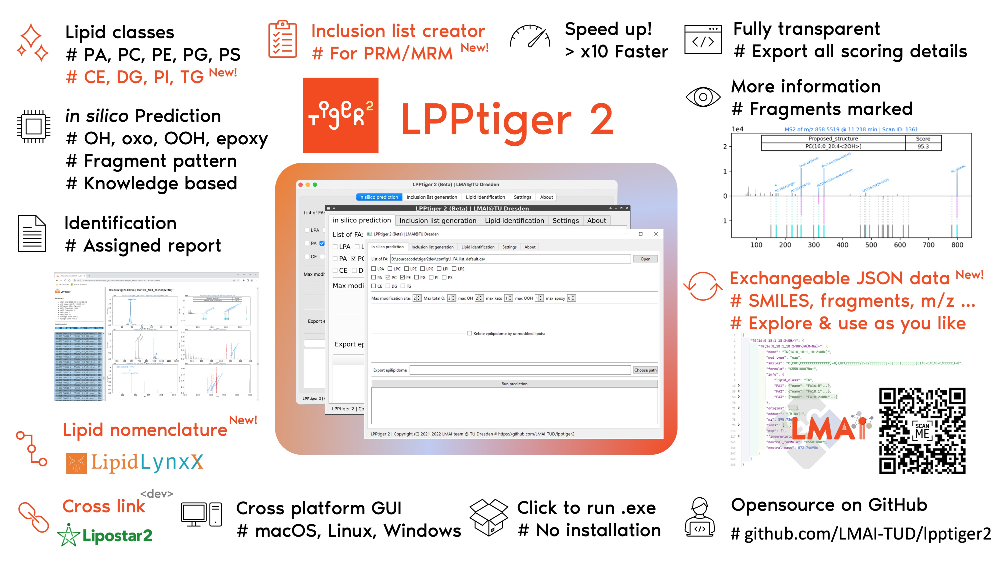
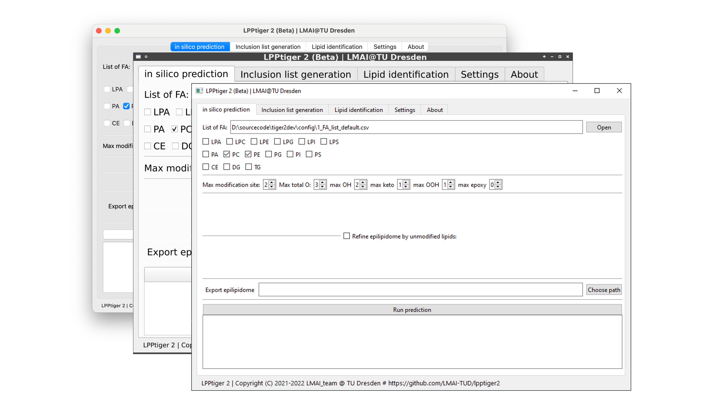

# LPPtiger 2

### [Check latest release ⬇](https://github.com/LMAI-TUD/lpptiger2/releases)

### [Current release v2.0-RC](https://github.com/LMAI-TUD/lpptiger2/releases)

#### Download .exe for Windows 10 or above (64bit only)

  + [https://github.com/LMAI-TUD/lpptiger2/releases/download/v2.0-RC/LPPtiger2_RC_win10_x64_exe.zip](https://github.com/LMAI-TUD/lpptiger2/releases/download/v2.0-RC/LPPtiger2_RC_win10_x64_exe.zip)

#### Download source code version for macOS (Apple silicon), Linux, and Windows (Win10, Win 11)

  + [https://github.com/LMAI-TUD/lpptiger2/archive/refs/tags/v2.0-RC.tar.gz](https://github.com/LMAI-TUD/lpptiger2/archive/refs/tags/v2.0-RC.tar.gz)
 + LPPtiger2 beta is developed using `Python 3.10` with `Anaconda` and `PyCharm Pro (Academic license)` 

#### Download user guide

  + [https://github.com/LMAI-TUD/lpptiger2/releases/download/v2.0-beta/LPPtiger2_user_guide.pdf](https://github.com/LMAI-TUD/lpptiger2/releases/download/v2.0-beta/LPPtiger2_user_guide.pdf)

#### Download tutorial pack including sample dataset

  + [https://github.com/LMAI-TUD/lpptiger2/releases/download/v2.0-RC/LPPtiger2_tutorial_pack.zip](https://github.com/LMAI-TUD/lpptiger2/releases/download/v2.0-RC/LPPtiger2_tutorial_pack.zip)

## About LPPtiger 2

LPPtiger 2 provides you a set of powerful functions to explor epilipidome.

Main functions:

+ Prediction of epilipidome

+ *in silico* fragmentation of epilipids

+ Generation of inclusion list

+ Identify epilipids at discrete level with modification type information

LPPtiger 2 provides a user-friendly intuitive graphic interface for multiple platforms including macOS (Apple silicon), Linux, and Windows (Win10, Win 11).

LPPtiger2 is developed based on the LPPtiger project (originally published in 2017):

[https://github.com/SysMedOs/lpptiger](https://github.com/SysMedOs/lpptiger)

### License

+ Copyright (C) 2021-2022  `LMAI_team` @ `TU Dresden`:
  
  + LMAI_team: Zhixu Ni, Maria Fedorova
+ Copyright (C) 2016-2021  `SysMedOs_team` @ `AG Bioanalytik, University of Leipzig`:
  
  + SysMedOs_team: Zhixu Ni, Georgia Angelidou, Maria Fedorova
+ LPPtiger2 is Dual-licensed
  
  + For academic and non-commercial use: `AGPL License V3` Please read more information by the following link:
    
    + [GNU Affero General Public License] (https://www.gnu.org/licenses/agpl-3.0.en.html)
  
  + For commercial use:
    
    + Please contact the LMAI_team by email.
    + https://tu-dresden.de/med/mf/zml/forschungsgruppen/fedorova/
+ Please cite our publication in an appropriate form:
  
  + Ni, Zhixu, Georgia Angelidou, Ralf Hoffmann, and Maria Fedorova.
    LPPtiger software for lipidome-specific prediction
    and hunter of oxidized phospholipids from LC-MS datasets
    Scientific Reports 7, Article number: 15138 (2017).
    DOI: 10.1038/s41598-017-15363-z
+ For more info please contact:
  
  + Developer Zhixu Ni: `zhixu.ni<at>tu-dresden.de`
  + LPPtiger2 repository: https://github.com/LMAI-TUD/lpptiger2

## Installation of LPPtiger 2

+ Windows .exe excutables
  
  + download the zip pack
  
  + unzip it to a folder
  
  + find the `LPPtiger2.exe` file
  
  + simply double click it and the interface will show up

+ Run from source code
  
  + install `anaconda` with Python 3.9 or 3.10
  
      + it is recommended to create a separate environment for LPPtiger2

      + create an environment with name envtiger: `conda create -n envtiger python=3.10`
      + following the command line guide to finish the environment setup
      + activate environment envtiger: `conda activate envtiger`
  
  + in anaconda environment, go to the LPPtiger2 source code folder
  
  + install requirements using `pip install -r ./requirements.txt`

    + optionally you can install following packages manually:

      + `matplotlib`
      + `natsort`
      + `numba`
      + `numpy`
      + `openpyxl`
      + `pandas`
      + `plotly`
      + `pymzml`
      + `pyside6`
      + `regex`
      + `rdkit`
      + `scipy`
      + `six`
  
  + run LPPtiger 2 `python ./LPPtiger2.py`
  
  + the interface will show up 

      
