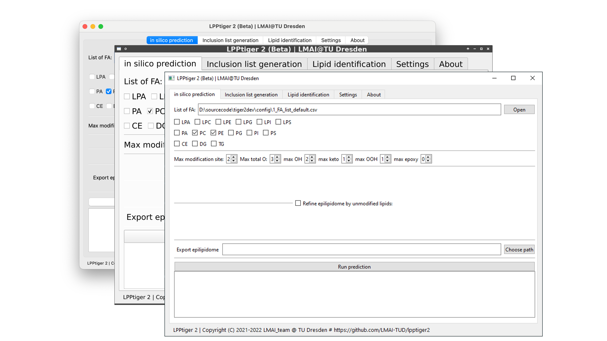

# LPPtiger 2 User Guide

`Date 2022.06.09`




[toc]


## About LPPtiger 2

LPPtiger 2 provides you a set of powerful functions to explor epilipidome.

Main functions:

+ Prediction of epilipidome

+ in silico fragmentation of epilipids

+ Generation of inclusion list

+ Identify epilipids at discrete level with modification type information


LPPtiger 2 provides a user-friendly intuitive graphic interface for multiple platforms including macOS (Apple silicon), Linux, and Windows (Win10, Win 11).


### License

+ Copyright (C) 2021-2022  `LMAI_team` @ `TU Dresden`:
  
  + LMAI_team: Zhixu Ni, Maria Fedorova

+ Copyright (C) 2016-2021  `SysMedOs_team` @ `AG Bioanalytik, University of Leipzig`:
  
  + SysMedOs_team: Zhixu Ni, Georgia Angelidou, Maria Fedorova

+ LPPtiger2 is Dual-licensed
  
  + For academic and non-commercial use: `AGPL License V3` Please read more information by the following link:
    
    + [GNU Affero General Public License] (https://www.gnu.org/licenses/agpl-3.0.en.html)
  
  + For commercial use:
    
    + Please contact the LMAI_team by email.
    + https://tu-dresden.de/med/mf/zml/forschungsgruppen/fedorova/

+ Please cite our publication in an appropriate form:
  
  + Ni, Zhixu, Georgia Angelidou, Ralf Hoffmann, and Maria Fedorova.
    LPPtiger software for lipidome-specific prediction
    and hunter of oxidized phospholipids from LC-MS datasets
    Scientific Reports 7, Article number: 15138 (2017).
    DOI: 10.1038/s41598-017-15363-z

+ For more info please contact:
  
  + Developer Zhixu Ni: `zhixu.ni<at>tu-dresden.de`
  + LPPtiger2 repository: https://github.com/LMAI-TUD/lpptiger2

## Installation of LPPtiger 2

+ Windows .exe excutables
  
  + download the zip pack
  + unzip it to a folder
  + sort content by groups
  
  
  
  + find the `LPPtiger2.exe` file

  
  
  + simply double click it and the interface will show up
  
    
  
+ source code
  
  + install `anaconda` with Python 3.9 or 3.10
  
  + in anaconda enviroment, go to the LPPtiger2 source code folder
  
  + install requirements using `pip install -r ./requirements.txt`
  
  + run LPPtiger 2 `python ./LPPtiger2.py`
  
  + the interface will show up 


## General interface

+ Prediction of epilipidome


+ Generation of inclusion list for PRM experiments


+ Identification of epilipids


+ About LPPtiger2


## Configuration files

All configureation files are located in folder `LPPtiger2/config`


You will see following files:


The `1_FA_list_default.csv` is the most important file which is loaded as default FA list for epilipidome prediction.

+ `1_FA_list_all.csv`: all currently supported FA
+ `1_FA_list_default.csv`: common FA by default, this list will be loaded by default, please change it to fit your common FA list
+ `1_FA_list_lite.csv`: a lite list template for you to run only limited FA


#### **#. Please make a copy of these configuration files before making changes**


## Step-by-step guide

### Task 1. Predict epilipidome

In this step we will try to predict two epilipidome: a `grand epilipidome` predicted using all FA combinations in the FA list, and a `refined epilipidome` generated by providing a list of possible lipids in the discreted form.

If you put crusor to some options, there will be tool tip pop up with more information about this option.


Here we use the `default FA list` and set following parameters:


Click on `Run prediction` to run the prediction, you will see the prediction status  in the information area. 


You can monitor the program status using task manager as well.


When the prediction finished, you will see the number of species predicted by LPPtiger2.


In this test, we predicted a `grand epilipidome` which contains 389569 predicted structures.


### Task 2. Predict Refined epilipidome

Now we will predict a `refined epilipidome` using a list of precursors from dominant species in the sample.

Below is an example of the xlsx file, please tune it based on your sample before runing your own data.


We use the same settings, just load this refined lipid list.


The run finished with a `refined epilipidome` which contains 1186 structures only.


Please use dominate unmodified lipids to predict `refined epilipidome` for further lipid identification steps.

The `grand epilipidome` can be used for database curation or other tasks, but not recommended for identification.

The output size is also related with the number of structures, please predict sample specific epilipidome.


The detailed predictions can be accessed directly from the JSON output file.

Examples of information predicted oxPC and oxTG are provided in the `Appendex`.


### Task 3. Create inclusion list for MS experiments

You can use the epilipidome predicted in `Task1` / `Task 2` to generate a list of precursors.

Here is an example of the parameters. Here we can use the list of unmodified lipids in `Task 2`.


Simply click `Generate inclusion list` and wait few seconds, the run will be finished.


Now you can open the output table:


You can use this list to prepare inclusion list for PRM experiments.

Additionally, you can use this list to prepare inclusion list for DDA acquision with inculsion list, and build transisions for SIM/MRM experiments.


### Task 4. Identify epilipids using mzML spectra

Here, we will run negative mode identification for oxPC and positive mode for oxCE and oxTG using the `refined epilipidome` generated in `Task2`.

In this GUI tab, there are also few tool tips to some options:


#### Task 4.1 identification of oxPC

Here we will use following settings:


Simply click `Hunt lipids!` to run identification analysis. The GUI may freeze for sometime due to heavy loads.

You can monitor the current running status of LPPtiger using the terminal.


When the run finished, you will see the total run time in seconds displayed on GUI.


In the output folder you will see a `html` file with a corresponding folder of images.


Double click on the `html` file, your default web browser will load the report with images.


In this report you can see the parameters of this run (top left), the identification table (bottom left), and assigned spectra (right side). Click on the lipid names in the identification table, the corresponding assigned spectra will be loaded on the right side.

Here below is the fragmentation pattern manually assigned.


We can see that LPPtiger automatically assigned the same set of structure specific peaks.

Additionally, LPPTiger can distinguish  different isomeric compounds and give different scores to suggest assignment of `<oxo>` or `<OH>` species.

The score of `PC(16:0_18:2<OH>)` is 77.3  is higher than score 74.6 of its isomer `PC(16:0_18:1<oxo>)`from the same MS/MS scan which suggest this scan can be assigned as  `PC(16:0_18:2<OH>)`.


A corresponding summary table of all scores is also generated. Please refine it based on the assigned spectra in the `html` report.


#### Task 4.2 identification of oxTG and oxCE

Here we will use following settings:


Simply click `Hunt lipids!` to run identification analysis. The GUI may freeze for sometime due to heavy loads. When the run finished, you will see the total run time in seconds displayed on GUI.


The output report looks like below:


Here below is the fragmentation pattern manually assigned.

We can see that LPPtiger automatically assigned the same set of structure specific peaks. LPPtiger 2 also detected peaks related to other structures e.g., isomers and isobars (marked in red). The ratio of total structure related signals and structure irrelevant signals is one of the five scoring algorithms used by LPPtiger 2. Using a sample specific `refined epilipidome` can significantly reduce the number of  structure irrelevant signals and improve identification score.


The output table is also provided.


## Important notice

Please do **NOT** use all possible FA all lipid classes to predict an all-in-one epilipidome from LPPtiger2.

The predicted epilipidome will contain over 2.5 Million candidate structures and export a JSON file larger than 12 GB.

It is **NOT** recommended to run such prediction and you should **NOT** use such big predicted epilipidome to run lipid identification.

If you insist load such big prediction in LPPtiger2, it will comsume over 100GB RAM and might provide large number of candidates with similar score. Large amout of isomeric species will reduce the specificity score of true positives and lower your identification quality.

It is **NOT** a good practice to search against over sized epilipid space.

It is recommended to run your sample with predicted epilipidome refined by most abundant unmodified lipids. Such talored sample specific search space can largely reduce false positives and provide more relevant results to your sample.


### Appendex

1. example of predicted oxPC
   
   ```json
   {
       "PC(16:0_18:2<OH>)": {
           "PC(16:0_18:2<OH>)#[M+HCOO]-": {
               "name": "PC(16:0_18:2<OH>)",
               "mod_type": "oap",
               "smiles": "[O-]P(OCC[N+](C)(C)C)(OCC(OC(CCCCCCC(O)/C=C/C/C=C/CCCCC)=O)COC(CCCCCCCCCCCCCCC)=O)=O",
               "formula": "C43H81O11NP-",
               "info": {
                   "lipid_class": "PC",
                   "FA1": {
                       "name": "FA16:0",
                       "mod_type": "unmod",
                       "smiles": "OC(CCCCCCCCCCCCCCC)=O",
                       "formula": "C16H32O2",
                       "exact_mass": 256.24023,
                       "mz_info": {
                           "[M-H]-": {
                               "formula": "C16H31O2-",
                               "mz": 255.232405
                           }
                       },
                       "origins": [
                           "FA16:0"
                       ]
                   },
                   "FA2": {
                       "name": "FA18:2<OH>",
                       "mod_type": "oap",
                       "smiles": "OC(CCCCCCC(O)/C=C/C/C=C/CCCCC)=O",
                       "formula": "C18H32O3",
                       "exact_mass": 296.235145,
                       "mz_info": {
                           "[M-H]-": {
                               "formula": "C18H31O3-",
                               "mz": 295.22732
                           }
                       },
                       "origins": [
                           "FA18:2"
                       ]
                   }
               },
               "origins": [
                   "PC(16:0_18:2)"
               ],
               "adduct": "[M+HCOO]-",
               "mz": 818.554724,
               "ions": {
                   "class_info": {
                       "PC:168#[M-H]-": {
                           "name": "PC:168",
                           "adduct": "[M-H]-",
                           "label": "PC:168#[M-H]-",
                           "remark": "demethylated PC head group [M-H]-",
                           "mod_type": "unmod",
                           "smiles": "",
                           "formula": "C4H11O4NP-",
                           "mz": 168.042572
                       },
                       "PC:224#[M-H]-": {
                           "name": "PC:224",
                           "adduct": "[M-H]-",
                           "label": "PC:224#[M-H]-",
                           "remark": "demethylated PC head group dehydrated glycerol ester [M-H]-",
                           "mod_type": "unmod",
                           "smiles": "",
                           "formula": "C7H15O5NP-",
                           "mz": 224.068787
                       },
                       "PC:242#[M-H]-": {
                           "name": "PC:242",
                           "adduct": "[M-H]-",
                           "label": "PC:242#[M-H]-",
                           "remark": "demethylated PC head group glycerol ester [M-H]-",
                           "mod_type": "unmod",
                           "smiles": "",
                           "formula": "C7H17O6NP-",
                           "mz": 242.079352
                       },
                       "PC:-60#NL": {
                           "name": "PC:-60",
                           "adduct": "[M+HCOO]-",
                           "label": "PC:-60#NL",
                           "remark": "-methyl (-CH3) [M-H]-",
                           "mod_type": "unmod",
                           "smiles": "",
                           "formula": "C45H81O11NP-",
                           "mz": 842.554724
                       },
                       "PC:-183#NL": {
                           "name": "PC:-183",
                           "adduct": "[M+HCOO]-",
                           "label": "PC:-183#NL",
                           "remark": "-PC head group",
                           "mod_type": "unmod",
                           "smiles": "",
                           "formula": "C41H69O7-",
                           "mz": 673.50433
                       }
                   },
                   "frag_info": {
                       "FA16:0#[M-H]-": {
                           "name": "FA16:0",
                           "adduct": "[M-H]-",
                           "label": "FA16:0#[M-H]-",
                           "formula": "C16H31O2-",
                           "mz": 255.232405
                       },
                       "FA18:2<OH>#[M-H]-": {
                           "name": "FA18:2<OH>",
                           "adduct": "[M-H]-",
                           "label": "FA18:2<OH>#[M-H]-",
                           "formula": "C18H31O3-",
                           "mz": 295.22732
                       },
                       "FA18:2<OH>#[M-H2O-H]-": {
                           "name": "FA18:2<OH>",
                           "adduct": "[M-H2O-H]-",
                           "label": "FA18:2<OH>#[M-H2O-H]-",
                           "formula": "C18H29O2-",
                           "mz": 277.216755
                       }
                   },
                   "nl_info": {
                       "LPC(18:2<OH>)#[M-H]-": {
                           "name": "LPC(18:2<OH>)",
                           "adduct": "[M-H]-",
                           "label": "LPC(18:2<OH>)#[M-H]-",
                           "formula": "C26H49O8NP-",
                           "mz": 534.319579
                       },
                       "LPC(18:2<OH>)#[M-H2O-H]-": {
                           "name": "LPC(18:2<OH>)",
                           "adduct": "[M-H2O-H]-",
                           "label": "LPC(18:2<OH>)#[M-H2O-H]-",
                           "formula": "C26H47O7NP-",
                           "mz": 516.309014
                       },
                       "LPC(18:2<OH>)#[M-CH3]-": {
                           "name": "LPC(18:2<OH>)",
                           "adduct": "[M-CH3]-",
                           "label": "LPC(18:2<OH>)#[M-CH3]-",
                           "formula": "C25H47O8NP-",
                           "mz": 534.319579
                       },
                       "LPC(18:2<OH>)#[M-CH3-H2O]-": {
                           "name": "LPC(18:2<OH>)",
                           "adduct": "[M-CH3-H2O]-",
                           "label": "LPC(18:2<OH>)#[M-CH3-H2O]-",
                           "formula": "C26H48O7NP",
                           "mz": 516.309014
                       },
                       "LPC(16:0)#[M-H]-": {
                           "name": "LPC(16:0)",
                           "adduct": "[M-H]-",
                           "label": "LPC(16:0)#[M-H]-",
                           "formula": "C24H49O7NP-",
                           "mz": 494.324664
                       },
                       "LPC(16:0)#[M-H2O-H]-": {
                           "name": "LPC(16:0)",
                           "adduct": "[M-H2O-H]-",
                           "label": "LPC(16:0)#[M-H2O-H]-",
                           "formula": "C24H47O6NP-",
                           "mz": 476.3141
                       },
                       "LPC(16:0)#[M-CH3]-": {
                           "name": "LPC(16:0)",
                           "adduct": "[M-CH3]-",
                           "label": "LPC(16:0)#[M-CH3]-",
                           "formula": "C23H47O7NP-",
                           "mz": 494.324664
                       },
                       "LPC(16:0)#[M-CH3-H2O]-": {
                           "name": "LPC(16:0)",
                           "adduct": "[M-CH3-H2O]-",
                           "label": "LPC(16:0)#[M-CH3-H2O]-",
                           "formula": "C24H48O6NP",
                           "mz": 476.3141
                       }
                   }
               },
               "msp": {
                   "mz": [
                       758.533595,
                       255.232405,
                       295.22732,
                       277.216755,
                       516.309014,
                       476.3141
                   ],
                   "i": [
                       800,
                       700,
                       999,
                       300,
                       100,
                       50
                   ],
                   "label": [
                       "PC:-60#NL",
                       "FA16:0#[M-H]-",
                       "FA18:2<OH>#[M-H]-",
                       "FA18:2<OH>#[M-H2O-H]-",
                       "LPC(18:2<OH>)#[M-CH3-H2O]-",
                       "LPC(16:0)#[M-CH3-H2O]-"
                   ],
                   "remark": [
                       "PC:-60#NL#C41H77O9NP-",
                       "FA16:0#[M-H]-#C16H31O2-",
                       "FA18:2<OH>#[M-H]-#C18H31O3-",
                       "FA18:2<OH>#[M-H2O-H]-#C18H29O2-",
                       "LPC(18:2<OH>)#[M-CH3-H2O]-#C26H48O7NP",
                       "LPC(16:0)#[M-CH3-H2O]-#C24H48O6NP"
                   ]
               },
               "fingerprints": [
                   150.032007,
                   168.042572,
                   206.058222,
                   224.068787,
                   242.079352,
                   255.232405,
                   259.20619,
                   277.216755,
                   277.216755,
                   295.22732,
                   476.3141,
                   494.324664,
                   498.298449,
                   516.309014,
                   516.309014,
                   534.319579,
                   571.472635,
                   589.4832,
                   740.52303,
                   758.533595,
                   818.554724
               ],
               "neutral_formula": "C42H80O9NP",
               "neutral_mass": 773.55707
           }
       }
   }
   ```
   
   

2. example of predicted oxTG

```json
{
    "TG(16:0_18:1_18:2<OH>)": {
        "TG(16:0_18:1_18:2<OH>)#[M+Na]+": {
            "name": "TG(16:0_18:1_18:2<OH>)",
            "mod_type": "oap",
            "smiles": "C(COC(CCCCCCCCCCCCCCC)=O)(OC(CCCCCCC/C=C/CCCCCCCC)=O)COC(CCCCCCC(O)/C=C/C/C=C/CCCCC)=O",
            "formula": "C55H100O7Na+",
            "info": {
                "lipid_class": "TG",
                "FA1": {
                    "name": "FA16:0",
                    "mod_type": "unmod",
                    "smiles": "OC(CCCCCCCCCCCCCCC)=O",
                    "formula": "C16H32O2",
                    "exact_mass": 256.24023,
                    "mz_info": {
                        "[M+H]+": {
                            "formula": "C16H33O2+",
                            "mz": 257.248055
                        },
                        "[M+Na]+": {
                            "formula": "C16H32O2Na+",
                            "mz": 279.23
                        }
                    },
                    "origins": [
                        "FA16:0"
                    ]
                },
                "FA2": {
                    "name": "FA18:1",
                    "mod_type": "oap",
                    "smiles": "OC(CCCCCCC/C=C/CCCCCCCC)=O",
                    "formula": "C18H34O2",
                    "exact_mass": 282.25588,
                    "mz_info": {
                        "[M+H]+": {
                            "formula": "C18H35O2+",
                            "mz": 283.263705
                        },
                        "[M+Na]+": {
                            "formula": "C18H34O2Na+",
                            "mz": 305.24565
                        }
                    },
                    "origins": [
                        "FA18:1"
                    ]
                },
                "FA3": {
                    "name": "FA18:2<OH>",
                    "mod_type": "oap",
                    "smiles": "OC(CCCCCCC(O)/C=C/C/C=C/CCCCC)=O",
                    "formula": "C18H32O3",
                    "exact_mass": 296.235145,
                    "mz_info": {
                        "[M+H]+": {
                            "formula": "C18H33O3+",
                            "mz": 297.24297
                        },
                        "[M+Na]+": {
                            "formula": "C18H32O3Na+",
                            "mz": 319.224915
                        }
                    },
                    "origins": [
                        "FA18:2"
                    ]
                }
            },
            "origins": [
                "TG(16:0_18:1_18:2)"
            ],
            "adduct": "[M+Na]+",
            "mz": 895.736675,
            "ions": {
                "class_info": {},
                "frag_info": {
                    "FA16:0#[M+H]+": {
                        "name": "FA16:0",
                        "adduct": "[M+H]+",
                        "label": "FA16:0#[M+H]+",
                        "formula": "C16H33O2+",
                        "mz": 257.248055
                    },
                    "FA16:0#[M+Na]+": {
                        "name": "FA16:0",
                        "adduct": "[M+Na]+",
                        "label": "FA16:0#[M+Na]+",
                        "formula": "C16H32O2Na+",
                        "mz": 279.23
                    },
                    "FA18:1#[M+H]+": {
                        "name": "FA18:1",
                        "adduct": "[M+H]+",
                        "label": "FA18:1#[M+H]+",
                        "formula": "C18H35O2+",
                        "mz": 283.263705
                    },
                    "FA18:1#[M+Na]+": {
                        "name": "FA18:1",
                        "adduct": "[M+Na]+",
                        "label": "FA18:1#[M+Na]+",
                        "formula": "C18H34O2Na+",
                        "mz": 305.24565
                    },
                    "FA18:2<OH>#[M+H]+": {
                        "name": "FA18:2<OH>",
                        "adduct": "[M+H]+",
                        "label": "FA18:2<OH>#[M+H]+",
                        "formula": "C18H33O3+",
                        "mz": 297.24297
                    },
                    "FA18:2<OH>#[M-H2O+H]+": {
                        "name": "FA18:2<OH>",
                        "adduct": "[M-H2O+H]+",
                        "label": "FA18:2<OH>#[M-H2O+H]+",
                        "formula": "C18H31O2+",
                        "mz": 279.232405
                    },
                    "FA18:2<OH>#[M+Na]+": {
                        "name": "FA18:2<OH>",
                        "adduct": "[M+Na]+",
                        "label": "FA18:2<OH>#[M+Na]+",
                        "formula": "C18H32O3Na+",
                        "mz": 319.224915
                    }
                },
                "nl_info": {
                    "DG(18:1_18:2<OH>)#[M+H]+": {
                        "name": "DG(18:1_18:2<OH>)",
                        "adduct": "[M+H]+",
                        "label": "DG(18:1_18:2<OH>)#[M+H]+",
                        "formula": "C39H71O6+",
                        "mz": 635.525065
                    },
                    "DG(18:1_18:2<OH>)#[M-H2O+H]+": {
                        "name": "DG(18:1_18:2<OH>)",
                        "adduct": "[M-H2O+H]+",
                        "label": "DG(18:1_18:2<OH>)#[M-H2O+H]+",
                        "formula": "C39H69O5+",
                        "mz": 617.5145
                    },
                    "DG(18:1_18:2<OH>)#[M+Na]+": {
                        "name": "DG(18:1_18:2<OH>)",
                        "adduct": "[M+Na]+",
                        "label": "DG(18:1_18:2<OH>)#[M+Na]+",
                        "formula": "C39H70O6Na+",
                        "mz": 657.50701
                    },
                    "DG(18:1_18:2<OH>)#[M-H2O+Na]+": {
                        "name": "DG(18:1_18:2<OH>)",
                        "adduct": "[M-H2O+Na]+",
                        "label": "DG(18:1_18:2<OH>)#[M-H2O+Na]+",
                        "formula": "C39H68O5Na+",
                        "mz": 639.496445
                    },
                    "DG(16:0_18:2<OH>)#[M+H]+": {
                        "name": "DG(16:0_18:2<OH>)",
                        "adduct": "[M+H]+",
                        "label": "DG(16:0_18:2<OH>)#[M+H]+",
                        "formula": "C37H69O6+",
                        "mz": 609.509415
                    },
                    "DG(16:0_18:2<OH>)#[M-H2O+H]+": {
                        "name": "DG(16:0_18:2<OH>)",
                        "adduct": "[M-H2O+H]+",
                        "label": "DG(16:0_18:2<OH>)#[M-H2O+H]+",
                        "formula": "C37H67O5+",
                        "mz": 591.49885
                    },
                    "DG(16:0_18:2<OH>)#[M+Na]+": {
                        "name": "DG(16:0_18:2<OH>)",
                        "adduct": "[M+Na]+",
                        "label": "DG(16:0_18:2<OH>)#[M+Na]+",
                        "formula": "C37H68O6Na+",
                        "mz": 631.49136
                    },
                    "DG(16:0_18:2<OH>)#[M-H2O+Na]+": {
                        "name": "DG(16:0_18:2<OH>)",
                        "adduct": "[M-H2O+Na]+",
                        "label": "DG(16:0_18:2<OH>)#[M-H2O+Na]+",
                        "formula": "C37H66O5Na+",
                        "mz": 613.480795
                    },
                    "DG(16:0_18:1)#[M+H]+": {
                        "name": "DG(16:0_18:1)",
                        "adduct": "[M+H]+",
                        "label": "DG(16:0_18:1)#[M+H]+",
                        "formula": "C37H71O5+",
                        "mz": 595.53015
                    },
                    "DG(16:0_18:1)#[M-H2O+H]+": {
                        "name": "DG(16:0_18:1)",
                        "adduct": "[M-H2O+H]+",
                        "label": "DG(16:0_18:1)#[M-H2O+H]+",
                        "formula": "C37H69O4+",
                        "mz": 577.519586
                    },
                    "DG(16:0_18:1)#[M+Na]+": {
                        "name": "DG(16:0_18:1)",
                        "adduct": "[M+Na]+",
                        "label": "DG(16:0_18:1)#[M+Na]+",
                        "formula": "C37H70O5Na+",
                        "mz": 617.512095
                    },
                    "DG(16:0_18:1)#[M-H2O+Na]+": {
                        "name": "DG(16:0_18:1)",
                        "adduct": "[M-H2O+Na]+",
                        "label": "DG(16:0_18:1)#[M-H2O+Na]+",
                        "formula": "C37H68O4Na+",
                        "mz": 599.50153
                    }
                }
            },
            "msp": {},
            "fingerprints": [
                257.248055,
                261.22184,
                279.23,
                279.232405,
                283.263705,
                297.24297,
                301.21435,
                305.24565,
                319.224915,
                573.488285,
                577.519586,
                591.49885,
                595.47023,
                595.53015,
                599.50153,
                599.503935,
                609.509415,
                613.480795,
                617.512095,
                617.5145,
                621.48588,
                631.49136,
                635.525065,
                639.496445,
                657.50701,
                895.736675
            ],
            "neutral_formula": "C55H100O7",
            "neutral_mass": 872.746906
        }
    }
}
```